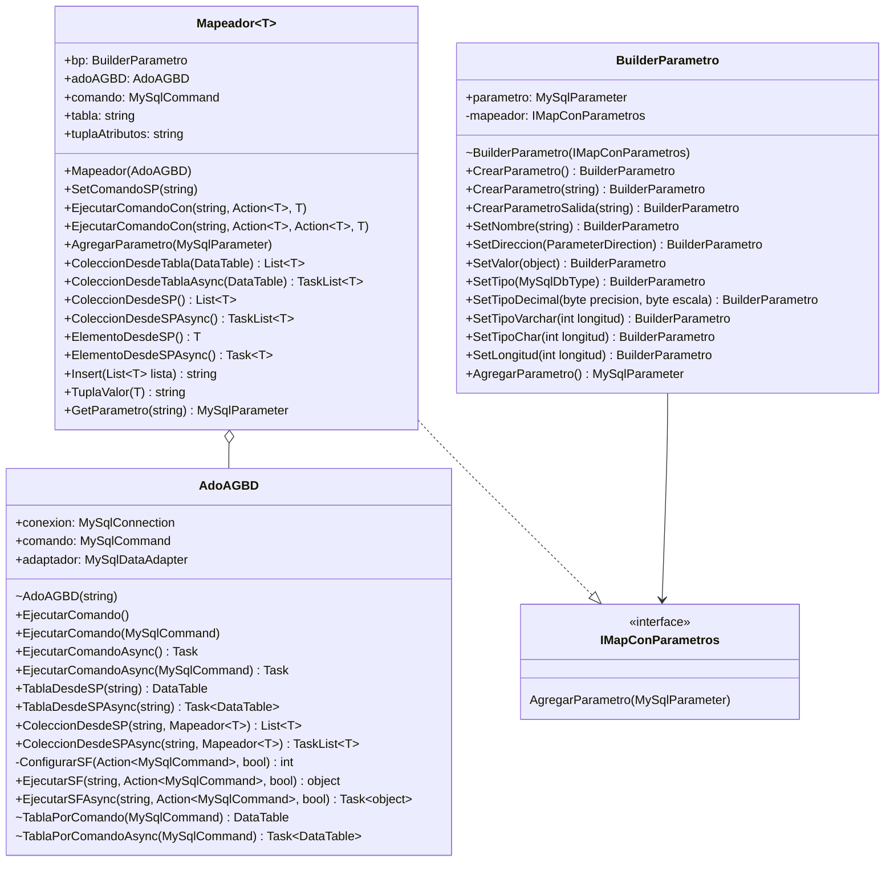

## Diagrama de clases

```mermaid
classDiagram
    class AdoAGBD{
        +conexion: MySqlConnection
        +comando: MySqlCommand
        +adaptador: MySqlDataAdapter
        ~AdoAGBD(string)
        +EjecutarComando()
        +EjecutarComando(MySqlCommand)
        +EjecutarComandoAsync() Task
        +EjecutarComandoAsync(MySqlCommand) Task
        +TablaDesdeSP(string) DataTable
        +TablaDesdeSPAsync(string) Task~DataTable~
        +ColeccionDesdeSP(string, Mapeador~T~) List~T~        
        +ColeccionDesdeSPAsync(string, Mapeador~T~) TaskList~T~
        -ConfigurarSF(Action~MySqlCommand~, bool) int
        +EjecutarSF(string, Action~MySqlCommand~, bool) object
        +EjecutarSFAsync(string, Action~MySqlCommand~, bool) Task~object~
        ~TablaPorComando(MySqlCommand) DataTable
        ~TablaPorComandoAsync(MySqlCommand) Task~DataTable~

    }

    class IMapConParametros{
        <<interface>>
        AgregarParametro(MySqlParameter)

    }

    class Mapeador~T~{
        +bp: BuilderParametro
        +adoAGBD: AdoAGBD
        +comando: MySqlCommand
        +tabla: string
        +tuplaAtributos: string
        +Mapeador(AdoAGBD)
        +SetComandoSP(string)
        +EjecutarComandoCon(string, Action~T~, T)
        +EjecutarComandoCon(string, Action~T~, Action~T~, T)
        +AgregarParametro(MySqlParameter)
        +ColeccionDesdeTabla(DataTable) List~T~
        +ColeccionDesdeTablaAsync(DataTable) TaskList~T~
        +ColeccionDesdeSP() List~T~
        +ColeccionDesdeSPAsync() TaskList~T~
        +ElementoDesdeSP() T
        +ElementoDesdeSPAsync() Task~T~
        +Insert(List~T~ lista) string
        +TuplaValor(T) string
        +GetParametro(string) MySqlParameter

    }

    class BuilderParametro{
        +parametro: MySqlParameter
        -mapeador: IMapConParametros
        ~BuilderParametro(IMapConParametros)
        +CrearParametro() BuilderParametro
        +CrearParametro(string) BuilderParametro
        +CrearParametroSalida(string) BuilderParametro
        +SetNombre(string) BuilderParametro
        +SetDireccion(ParameterDirection) BuilderParametro
        +SetValor(object) BuilderParametro
        +SetTipo(MySqlDbType) BuilderParametro
        +SetTipoDecimal(byte precision, byte escala) BuilderParametro
        +SetTipoVarchar(int longitud) BuilderParametro
        +SetTipoChar(int longitud) BuilderParametro
        +SetLongitud(int longitud) BuilderParametro
        +AgregarParametro() MySqlParameter
    }

    BuilderParametro --> IMapConParametros
    Mapeador~T~ o-- AdoAGBD
    Mapeador~T~ ..|> IMapConParametros   

```