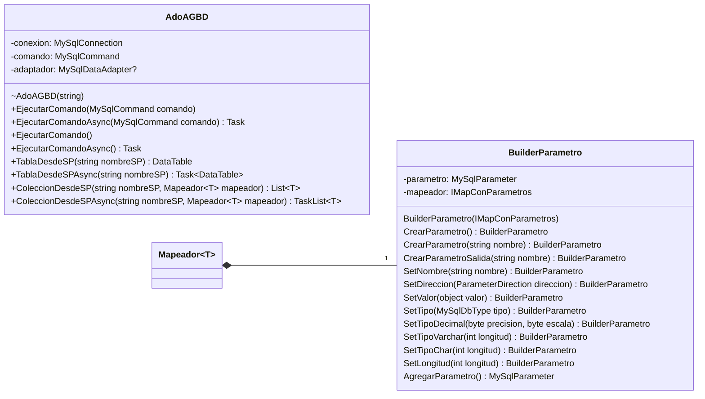

## Diagrama de Clases

```mermaid
classDiagram
    direction LR
    class AdoAGBD{
        -conexion: MySqlConnection
        -comando: MySqlCommand
        -adaptador: MySqlDataAdapter?
        ~AdoAGBD(string)
        +EjecutarComando(MySqlCommand comando)
        +EjecutarComandoAsync(MySqlCommand comando) Task
        +EjecutarComando()
        +EjecutarComandoAsync() Task
        +TablaDesdeSP(string nombreSP) DataTable
        +TablaDesdeSPAsync(string nombreSP) Task~DataTable~
        +ColeccionDesdeSP(string nombreSP, Mapeador~T~ mapeador) List~T~
        +ColeccionDesdeSPAsync(string nombreSP, Mapeador~T~ mapeador) TaskList~T~
        
    }
    class BuilderParametro{
        -parametro: MySqlParameter
        -mapeador: IMapConParametros
        BuilderParametro(IMapConParametros)
        CrearParametro() BuilderParametro
        CrearParametro(string nombre) BuilderParametro
        CrearParametroSalida(string nombre) BuilderParametro
        SetNombre(string nombre) BuilderParametro
        SetDireccion(ParameterDirection direccion) BuilderParametro
        SetValor(object valor) BuilderParametro
        SetTipo(MySqlDbType tipo) BuilderParametro
        SetTipoDecimal(byte precision, byte escala) BuilderParametro
        SetTipoVarchar(int longitud) BuilderParametro
        SetTipoChar(int longitud) BuilderParametro
        SetLongitud(int longitud) BuilderParametro
        AgregarParametro() MySqlParameter
    }
    class Mapeador~T~{

    }

    Mapeador~T~ *-- "1" BuilderParametro
```